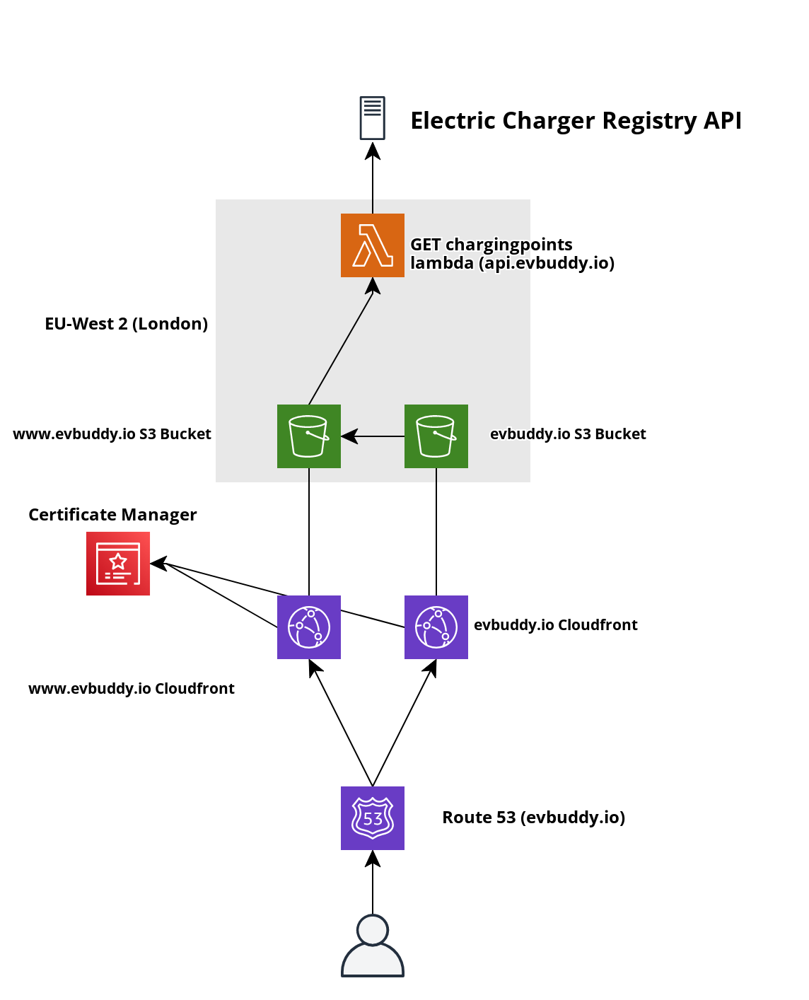

# Technical Specification

This document provides a technical specification for an electric vehicle charger mapping platform. Designed as a side project to learn and understand how AWS works.

# Requirements

Create a platform that allows a website to visualise electric vehicle charging points on a map. 

Take into account cost effectiveness and the ability to retrieve charging points from different sources.

# System Diagram

# System Explanation

A discussion of how the architecture works can be found [here](https://www.darrylbayliss.net/building-ev-buddy/)
